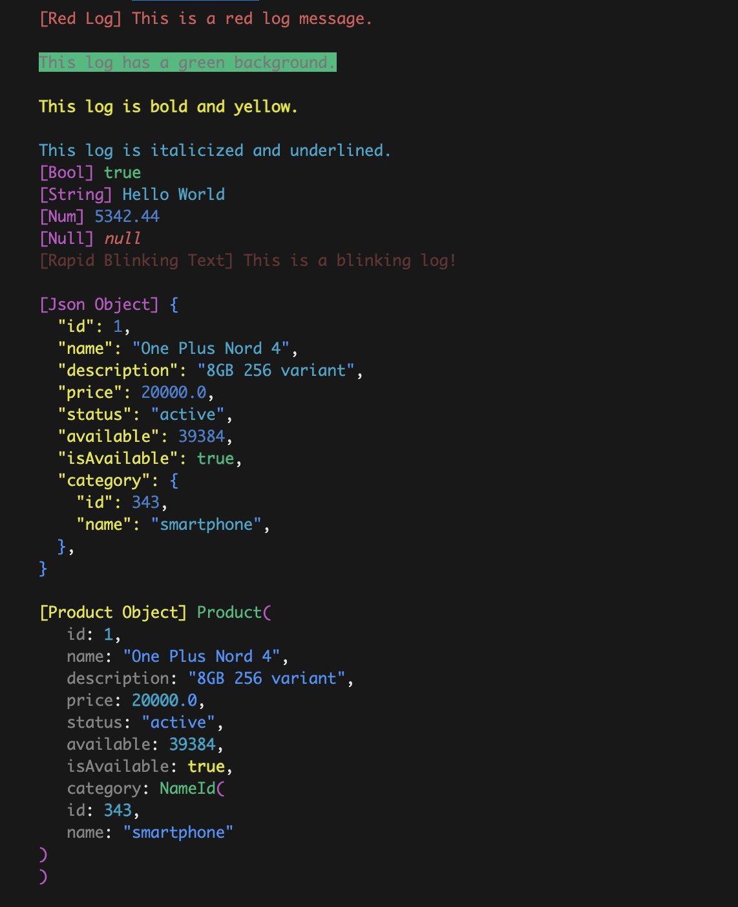
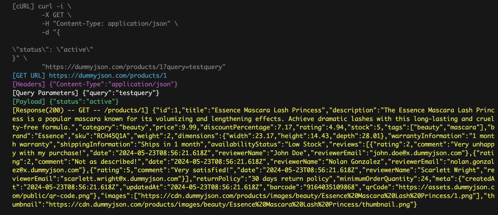

# ColoredLog
Say no to ***boring*** `print()` statement.<br>
Bring colors and fun to your logs using `ColoredLogs()`. 

A feature-rich, simple-to-use logging package for Dart that allows you to colorize logs, change background colors, stylize and much more! Perfect for both development and debugging.

## Features
- **Colorize Logs**: Add colors to log messages for easy identification.
- **Colorize api requests**: Console your all api calls using `ColoredLogDioInterceptor()`.
- **Disable Logs**: We can disable logs all over the project using just single line statement.
- **Custom Background Colors**: Change the background color of your logs for better visibility.
- **Text Stylization**: Bold, italic, underline, and more, stylize your logs for better emphasis.
- **Blinking Logs**: Make log messages blink to grab attention.
- **Simple API**: Easy-to-use interface for logging without any complexity.
- **Cross-Platform**: Works seamlessly across all Dart-supported platforms.

## Installation
To get started, add the following dependency to your pubspec.yaml:

```yaml
dependencies:
  colored_log: ^1.0.0
```
Run `dart pub get` or  `flutter pub get` to install the package.

## Usage
`name` is optional but very helpful, we can name each log and know exactly which log is triggered.
### Basic Logging
```dart
import 'package:colored_log/colored_log.dart';

void main() {
  // Default log
  ColoredLog("This is a simple log message.");
}

```
### Customizing Logs
You can customize the color, background, and style of your logs.
```dart
import 'package:colored_log/colored_log.dart';

void main() {
 // Red-colored text
  // name is optional
  ColoredLog.red(
    "This is a red log message.\n",
    name: 'Red Log',
  );

  // Custom background color
  ColoredLog.black(
    "This log has a green background.\n",
    background: LogColor.green,
  );

  // Bold yellow text
  ColoredLog.yellow(
    "This log is bold and yellow.\n",
    style: LogStyle.bold,
  );

  // Italicized
  ColoredLog(
    "This log is italicized and underlined.",
    style: LogStyle.italicized,
  );

  //Auto Coloring based on value type
  ColoredLog(true, name: 'Bool');
  ColoredLog('Hello World', name: 'String');
  ColoredLog(5342.44, name: 'Num');
  ColoredLog(null, name: 'Null');

  // Blinking text
  ColoredLog.red(
    "This is a blinking log!\n",
    name: 'Rapid Blinking Text',
    style: LogStyle.blinkRapid,
  );

  // It formats json and prints in colored format
  ColoredLog(product.toMap(), name: 'Json Object');

  print('');

  // It formats object and prints in colored format
  // if toString() is overriden and formated in correct way
  ColoredLog(product, name: 'Product Object', color: LogColor.yellow);
}


```
 > Output




### Advanced Styling
Combine multiple styles to create unique logs that stand out.
```dart
void main() {
  // Combine colors, background, and styles
  ColoredLog("This is a bold log with blue text and yellow background.",
    color: LogColor.blue,
    backgroundColor: LogColor.yellow,
    style: LogStyle.bold,
    autoColoring: false,
    );
}
```

### Using Dio Interceptor
- When we use dio interceptor It Will log all requests, responses and errors
- Simple to setup
- we just need to add a dio interceptor `ColoredLogDioInterceptor()` for this setup
```dart
void main() async{
  //Adding  Dio Interceptors
  Dio dio = Dio();
  dio.interceptors.add(ColoredLogDioInterceptor(showCurl: true)); //This is the only single line setup that we need

  // Performing a dio request
  await dio.get(
    'https://dummyjson.com/products/1',
    queryParameters: {'query': 'testquery'},
    data: {'status': 'active'},
    options: Options(headers: {"Content-Type": "application/json"}),
  );
}
```
Console log


## Config
We can set default log color and logType as follow
```dart
//We can set default log color when we use constructor
ColoredLog.setDefaultColor=LogColor.yellow;

//We can set logType as with respective functionality
//enum LogType { print, logs, hideLogs }
//We need to make sure to run it on start
ColoredLog.setLogType=LogType.print;

//To hide logs 
ColoredLog.setLogType=LogType.hideLogs;
```

## Notes
This package is designed to work best in environments that support ANSI escape codes (e.g., most terminal/console applications).
Blinking logs may not be supported in all terminal environments.
The package is designed for simplicity but offers plenty of flexibility for advanced use cases.

## License
This package is licensed under the MIT License.

## Maintainers

<br>
[Prabhat Kumar](http://github.com/thisisprabhat)